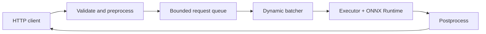

# Realtime CV Serving

An observable, bounded-latency ONNX object-detection serving stack with dynamic batching.

> Status: M0 setup and licensing decision. Benchmark results: **TBD (not yet measured)**.

## Why this exists

This project focuses on deployment behavior—batching, queue limits, deadlines, correctness,
and measurements—not training a detector.

## Architecture



## Quickstart

Requires Python 3.11–3.13 and [uv](https://docs.astral.sh/uv/).

```powershell
uv sync --extra dev
uv run pytest
```

Model downloads are deliberately not automatic. See [MODEL_CARD.md](MODEL_CARD.md) before
supplying any weights.

## Design and limitations

See [docs/DESIGN.md](docs/DESIGN.md), [docs/LIMITATIONS.md](docs/LIMITATIONS.md), and
[docs/RESULTS.md](docs/RESULTS.md). The serving API and measured results arrive in later
milestones.

## License

This repository is MIT-licensed. Detector source and weights have separate terms; see the
model card.
